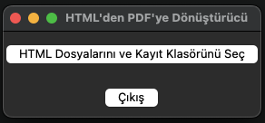

# HTML to PDF Converter

Bu araç, HTML dosyalarını kolayca PDF dosyalarına dönüştürmenizi sağlar.

HTML dosyaları, web sayfalarının temel yapı taşlarıdır ve çeşitli alanlarda kullanılır. Bu araç sayesinde, HTML dosyalarını PDF formatına dönüştürerek daha kolay paylaşabilir ve saklayabilirsiniz.

## Özellikler

- HTML dosyalarını PDF formatına dönüştürme
- Basit ve kullanıcı dostu grafik arayüz

## Gereksinimler

- Python 3.x
- pyppeteer kütüphanesi

## Kurulum

1. Bu projeyi klonlayın veya indirin:

   ```sh
   git clone https://github.com/phokai/html_to_pdf.git
   cd html_to_pdf_converter
   ```

2. Gerekli kütüphaneleri yükleyin:

   ```sh
   pip install pyppeteer
   ```

3. Uygulamayı derleyin:
   - macOS için:
     ```sh
     pyinstaller --windowed --name="HTML_PDF_Converter" --noconsole --icon=img/app_icon.icns "main.py"
     ```
   - Windows için:
     ```sh
     pyinstaller --windowed --name="HTML_PDF_Converter" --noconsole --icon=img/app_icon.ico "main.py"
     ```
   - Linux için:
     ```sh
     pyinstaller --windowed --name="HTML_PDF_Converter" --noconsole --icon=img/app_icon.ico "main.py"
     ```

## Kullanım

HTML dosyalarını basit grafik arayüz ile PDF dosyasına dönüştürebilirsiniz.



1. HTML dosyalarını ve kayıt klasörünü seçin.
2. Dosyalar seçildikten ve kayıt klasörü belirlendikten sonra dönüştürme işlemi otomatik olarak başlayacaktır.
3. Dönüştürme işlemi tamamlandığında, "Dönüştürme Tamamlandı" mesajı görüntülenecektir.
